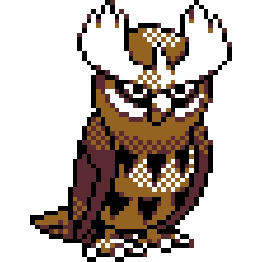

# NoctOWL   

This repository contains the code to train **NoctOWL** (***N****ot **o**nly **c**oarse-**t**ext **OWL***), an adaptation of the OWL detector specifically designed for **Fine-Grained Open-Vocabulary Detection (FG-OVD)**. NoctOWL is optimized to balance fine- and coarse-grained detection capabilities, improving recognition of subtle object attributes such as color, material, and pattern.  

## Installation  

To set up the environment, run: 

```bash
conda create --name NoctOWL python=3.9 -y
conda activate NoctOWL
pip3 install torch torchvision torchaudio --index-url https://download.pytorch.org/whl/cu118
pip install -r requirements.txt
```  

## Using NoctOWL  

NoctOWL model weights are hosted on [**Hugging Face**](https://huggingface.co/lorebianchi98). To load the models, use the following code:  

```python
from transformers import OwlViTForObjectDetection, Owlv2ForObjectDetection, OwlViTProcessor, Owlv2Processor

# NoctOWL Base
noctowl_base = OwlViTForObjectDetection.from_pretrained('lorebianchi98/NoctOWL-base-patch16')
processor_base = OwlViTProcessor.from_pretrained('google/owlvit-base-patch16')

# NoctOWLv2 Base
noctowlv2_base = Owlv2ForObjectDetection.from_pretrained('lorebianchi98/NoctOWLv2-base-patch16')
processorv2_base = Owlv2Processor.from_pretrained('google/owlv2-base-patch16')

# NoctOWL Large
noctowl_large = OwlViTForObjectDetection.from_pretrained('lorebianchi98/NoctOWL-large-patch14')
processor_large = OwlViTProcessor.from_pretrained('google/owlvit-large-patch14')

# NoctOWLv2 Large 
noctowlv2_large = Owlv2ForObjectDetection.from_pretrained('lorebianchi98/NoctOWLv2-large-patch14')
processorv2_large = Owlv2Processor.from_pretrained('google/owlv2-large-patch14')
```  

## Training  

To train NoctOWL, use:  

```bash
python main.py --config path/to/config --out path/to/weights
```  

## Evaluation
To reproduce the results reported in our paper, we compute **ranks** and **mAPs** for each benchmark, evaluating the model on the LVIS validation set.  


### FG-OVD Evaluation  

To evaluate NoctOWL on **FG-OVD**, follow these steps:  

1. **Generate predictions**  
2. **Evaluate ranking performance**  
3. **Evaluate mAP scores**  

Make sure your trained model weights are located at `path/to/model/weights/model_name`, then run:  

```bash
# Generate predictions (saved in 'predictions_fgovd/model_name')
python results.py --model path/to/model/weights/model_name --output_base predictions_fgovd --tokenizer google/owlvit-base-patch16  
# Select the correct tokenizer based on the base model:
# - google/owlvit-base-patch16
# - google/owlv2-base-patch16
# - google/owlvit-large-patch14
# - google/owlv2-large-patch14

# Evaluate rank performance
python run_all_ranks.py --model_predictions predictions_fgovd/model_name --output_base ranks

# Evaluate mAP scores
python run_all_predictions.py --model_predictions predictions_fgovd/model_name --output_base maps
```  

---

### LVIS Evaluation  

To evaluate **NoctOWL** on the **LVIS validation set**, refer to the original **OWL-ViT** repository:  
[**OWL-ViT Repository**](https://github.com/google-research/scenic/tree/main/scenic/projects/owl_vit)  

#### Steps:  
1. Follow the **installation instructions** from the OWL-ViT repo to set up the required **conda environment**.  
2. Replace the original `evaluator.py` with our modified script:  

   **Replace:** `scenic/projects/owl_vit/evaluator.py`  
   **With:** `eval/lvis/evaluator.py` from this repository.  

Our script transfers NoctOWL’s trained layers into OWL’s TensorFlow evaluation framework.  

#### Example Evaluation Command (NoctOWLv2 Base):  

```bash
python -m scenic.projects.owl_vit.evaluator \
  --alsologtostderr=true \
  --platform=gpu \
  --config=owl_v2_clip_b16 \
  --checkpoint_path=weights/owl2-b16-960-st-ngrams_c7e1b9a \
  --annotations_path=annotations/lvis_v1_val.json \
  --tfds_data_dir=data_dir \
  --output_dir=tmp \
  --noctowl_weights=lorebianchi98/NoctOWLv2-base-patch16
```  

---

## Results

We report the mean Average Precision (**mAP**) on the Fine-Grained Open-Vocabulary Detection ([FG-OVD](https://lorebianchi98.github.io/FG-OVD/)) benchmarks across different difficulty levels, as well as performance on rare classes from the LVIS dataset.
| Model | LVIS (Rare) | Trivial | Easy | Medium | Hard | Color | Material | Pattern | Transparency |  
|-------|------------|----------------|---------------|---------------|---------------|-------|----------|---------|--------------|  
| OWL (B/16) | 20.6 | 53.9 | 38.4 | 39.8 | 26.2 | 45.3 | 37.3 | 26.6 | 34.1 |  
| OWL (L/14) | 31.2 | 65.1 | 44.0 | 39.3 | 26.5 | 43.8 | 44.9 | 36.0 | 29.2 |  
| OWLv2 (B/16) | 29.6 | 52.9 | 40.0 | 38.5 | 25.3 | 45.1 | 33.5 | 19.2 | 28.5 |  
| OWLv2 (L/14) | **34.9** | 63.2 | 42.8 | 41.2 | 25.4 | 53.3 | 36.9 | 23.3 | 12.2 |  
| **NoctOWL (B/16)** | 11.6 | 46.6 | 44.4 | 45.6 | 40.0 | 44.7 | 46.0 | 46.1 | 53.6 |  
| **NoctOWL (L/14)** | 26.0 | 57.4 | 54.2 | 54.8 | 48.6 | 53.1 | 56.9 | **49.8** | **57.2** |  
| **NoctOWLv2 (B/16)** | 17.5 | 48.3 | 49.1 | 47.1 | 42.1 | 46.8 | 48.2 | 42.2 | 50.2 |  
| **NoctOWLv2 (L/14)** | 27.2 | **57.5** | **55.5** | **57.2** | **50.2** | **55.6** | **57.0** | 49.2 | 55.9 |  

## Acknowledgments  

This repository is inspired by [this implementation](https://github.com/stevebottos/owl-vit-object-detection).  
Special thanks to **[@stevebottos](https://github.com/stevebottos)** for its contributions.  
